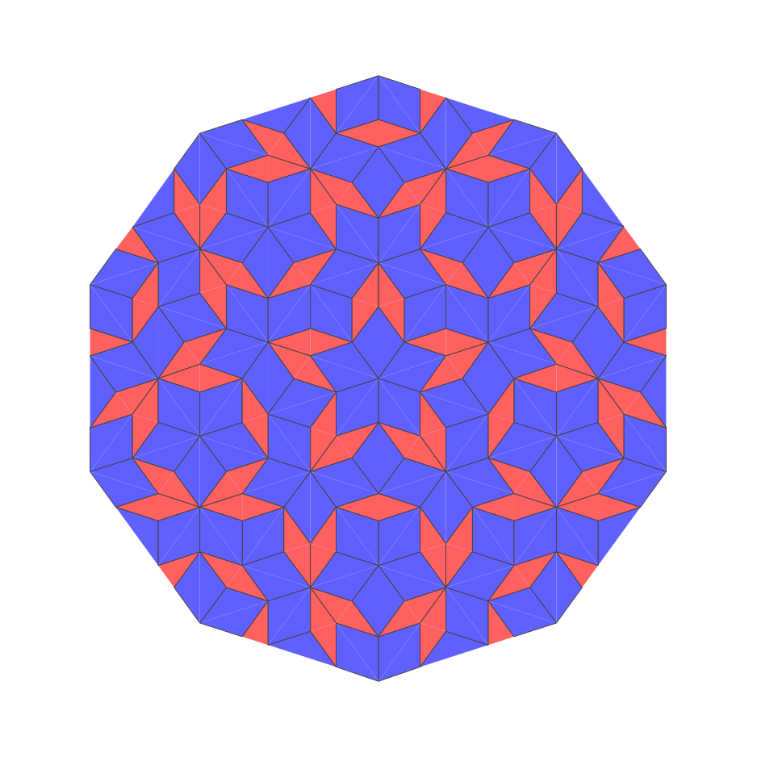

# Penrose tiling


## About

This program generates svg files of the [Penrose tiling](https://en.wikipedia.org/wiki/Penrose_tiling). Here is the output at depth 4:



Starting from 10 red triangles distributed along a circle, each triangle is subdivided.

There are 2 kinds of triangles, red and blue, and each are subdivided differently, always creating new red or blue triangles with the same proportions:


## Usage

You can provide the depth (1 to 10, default 5), the number of subdivisions of the circle (10 for penrose), and the start color (red or blue, default red)

```bash
$ ruby main.rb > penrose-depth-5.svg
$ ruby main.rb 3 10 blue > test.svg
```

## Credits

This piece of code is very heavily inspired by [this post](https://preshing.com/20110831/penrose-tiling-explained/).

